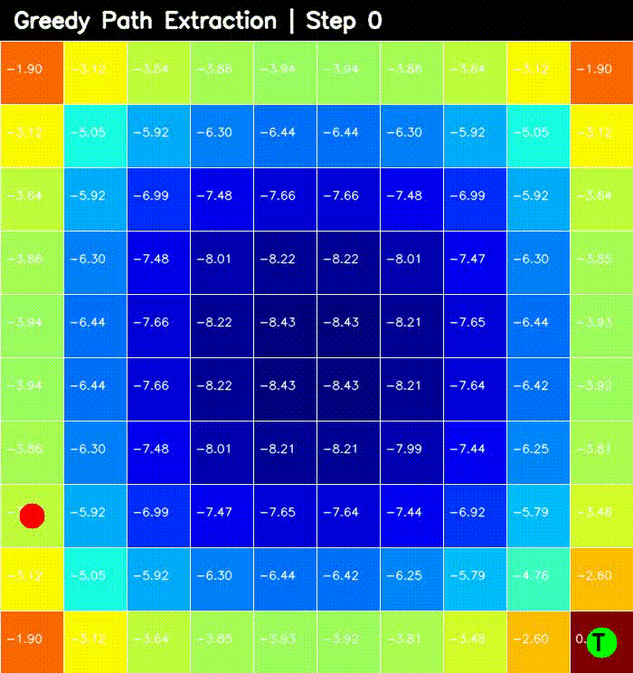

# Gridworld Policy Evaluation

This project implements **policy evaluation** on a `10×10` Gridworld using a random policy.

Each state is updated using the **Bellman expectation equation** until the value table converges. After evaluation, a greedy path is extracted by moving to the neighboring state with the highest value.

---

## Demo

### Greedy Path Visualization

The animation below shows the agent following the greedy path extracted from the final value table.



If the GIF does not load, you can view the MP4 version here:

[View path visualization video](path_visualization.mp4)

---

## Project Overview

The goal of this project is to understand how **Dynamic Programming** is used in Reinforcement Learning to estimate the value of states under a fixed policy.

The project includes:

- A `10×10` Gridworld environment
- A terminal state at the bottom-right corner
- A random policy with equal probability for all actions
- Iterative policy evaluation
- Value-table visualization
- Greedy path extraction from the final value table
- Path visualization saved as a video/GIF

---

## Gridworld Setup

The environment is a `10×10` grid.

```text
. . . . . . . . . .
. . . . . . . . . .
. . . . . . . . . .
. . . . . . . . . .
. . . . . . . . . .
. . . . . . . . . .
. . . . . . . . . .
. . . . . . . . . .
. . . . . . . . . .
. . . . . . . . . T
```

Where:

- `T` is the terminal state
- Every normal state has reward `-1`
- The terminal state has reward `+1`
- The agent starts from a random position
- The discount factor is set to `0.5`

---

## Policy

The agent starts with a random policy.

For every state:

```text
left  = 0.25
right = 0.25
up    = 0.25
down  = 0.25
```

This means the agent is equally likely to move in any of the four directions.

---

## Bellman Expectation Equation

The value of a state is updated using:

```math
V(s) = \sum_a \pi(a|s)\left[r + \gamma V(s')\right]
```

Where:

- `V(s)` is the value of the current state
- `π(a|s)` is the probability of taking action `a` in state `s`
- `r` is the reward
- `γ` is the discount factor
- `V(s')` is the value of the next state

---

## Policy Evaluation

Policy evaluation estimates the value of every state under the current policy.

The update is repeated until the value table stops changing significantly.

```python
if np.linalg.norm(V_new - V_old) < delta:
    break
```

The final value table tells us how good each state is under the random policy.

---

## Greedy Path Extraction

After policy evaluation, a greedy path is extracted from the final value table.

At each step, the agent looks at the neighboring states and moves to the one with the highest value.

```python
best_action = argmax(V(next_state))
```

This is not the same as following the random policy. It is closer to a simple **policy improvement** step.

---

## Visualizations

### Value Table Visualization

The value table is visualized as a heatmap.

Each cell shows the estimated value of that state.

```python
visualize_value_iteration(value_table_renditions)
```

### Path Visualization

The final greedy path is saved as:

```text
path_visualization.mp4
path_visualization.gif
```

The GIF version is used in the README preview.

---

## Example Output

```text
start: [0, 4]
terminal: [9, 9]

path:
[[0, 4], [1, 4], [2, 4], [3, 4], ..., [9, 9]]
```

The exact path changes because the start position is randomly selected.

---

## Project Structure

```text
policy-iteration/
│
├── main.py
├── visualization.py
├── path_visualization.mp4
├── path_visualization.gif
├── README.md
└── .gitignore
```

---

## How to Run

Clone the repository:

```bash
git clone https://github.com/aaryadevchandra/policy-iteration.git
cd policy-iteration
```

Install dependencies:

```bash
pip install numpy opencv-python
```

Run the project:

```bash
python main.py
```

---

## Requirements

```text
numpy
opencv-python
```

---

## Concepts Covered

- Reinforcement Learning
- Markov Decision Processes
- State-value functions
- Bellman expectation equation
- Iterative policy evaluation
- Greedy policy improvement
- Gridworld environments
- OpenCV visualization

---

## Important Note

This project evaluates a **random policy** first, then extracts a greedy path from the final value table.

So the path extraction step is not pure policy evaluation. It is closer to a basic policy improvement step.

A full control algorithm would require implementing:

- Policy Iteration
- Value Iteration
- Q-Learning
- Monte Carlo Control

---

## Future Improvements

- Implement full policy iteration
- Implement value iteration
- Add obstacles and walls
- Add stochastic transitions
- Add policy arrows visualization
- Compare random policy vs improved policy
- Add multiple terminal states

---

## License

This project is for learning and experimentation.
